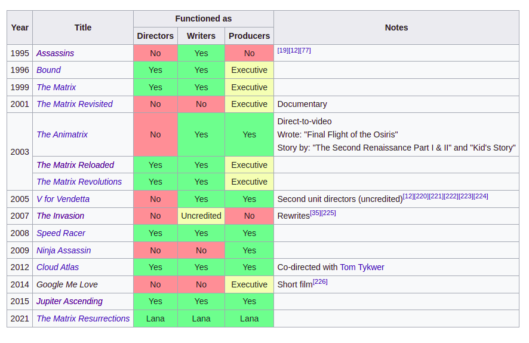

# `table-data`

To process human-readable Wikipedia tables in a machine-friendly way, WikipediaQL implements **EXPERIMENTAL** `table-data` quasi-selector/filter. It does the following:

* Normalize all `colspan`s and `rowspan`s (joined columns)
* Move the row and column headers to attributes: so, after the `table-data`, table has only data cells, but each of them has attributes `column="<column text>"` and `row="<row text>"`, and the `tr`s have attribute `title="<row text>`; Note that multi-level `th`s are handled by joining levels with `\n` (linebreak)
* Apply special handling to full-row `colspan`-ned cells:
  * If it is the first row of the table, it is considered table's title (and not added to all columns as a part of their title)
  * If it is the only `td` in the middle of the row, it is considered continuation of the previous row.

## Examples

Consider this table (from [The Wachowskis](https://en.wikipedia.org/wiki/The_Wachowskis#Films))


This query:
```py
wikipedia.query(r'''
from "The Wachowskis" {
    section[heading="Films"] >> table >> table-data >> tr {
        td[column="Year"] as "year";
        td[column="Title"];
        td[column$="Directors"] as "directors"
    }
}
''')
```

Will produce the following output:
```
[{'directors': 'No', 'title': 'Assassins', 'year': '1995'},
 {'directors': 'Yes', 'title': 'Bound', 'year': '1996'},
 {'directors': 'Yes', 'title': 'The Matrix', 'year': '1999'},
 {'directors': 'No', 'title': 'The Matrix Revisited', 'year': '2001'},
 {'directors': 'No', 'title': 'The Animatrix', 'year': '2003'},
 {'directors': 'Yes', 'title': 'The Matrix Reloaded', 'year': '2003'},
 {'directors': 'Yes', 'title': 'The Matrix Revolutions', 'year': '2003'},
 {'directors': 'No', 'title': 'V for Vendetta', 'year': '2005'},
 {'directors': 'No', 'title': 'The Invasion', 'year': '2007'},
 {'directors': 'Yes', 'title': 'Speed Racer', 'year': '2008'},
 {'directors': 'No', 'title': 'Ninja Assassin', 'year': '2009'},
 {'directors': 'Yes', 'title': 'Cloud Atlas', 'year': '2012'},
 {'directors': 'No', 'title': 'Google Me Love', 'year': '2014'},
 {'directors': 'Yes', 'title': 'Jupiter Ascending', 'year': '2015'},
 {'directors': 'Lana', 'title': 'The Matrix Resurrections', 'year': '2021'}]
```

Note that:
* after `table-data`, we can just select `td` by `column` attribute;
* `Year` column (joined in 2003) was handled correctly
* the nesting "Functioned as..." produced column names like `"Functioned as\nDirectors"`, so we use `column$=` (ends with) selector.


Example of handling of full-row `td`s: Assuming the following table (from [this page](https://en.wikipedia.org/wiki/Breaking_Bad_(season_1)#Episodes))


We can parse it as simple as
```py
wikipedia.query(r'''
from "Breaking Bad (season 1)" {
    section[heading="Episodes"] >> table >> table-data >> tr {
        td[column="No. in season"] as "num";
        td[column="Title"] as "title";
        td:last-child as "synopsys"
    }
}
''')
```

....receiving the following result (synopses are shortened when pasting them here):
```
[{'num': '1',
  'synopsys': 'Walter White, a 50-year-old high school chemistry teacher facing a midlife crisis, finds out he has Stage 3, inoperable lung cancer. <...>',
  'title': '"Pilot"'},
 {'num': '2',
  'synopsys': 'Walt and Jesse try to dispose of the two bodies in the RV, which becomes increasingly complicated when one of them, Krazy-8, wakes up. <...>',
  'title': '"Cat\'s in the Bag..."'},
 {'num': '3',
  'synopsys': 'Walt cannot decide whether to kill Krazy-8 or release him. <...>',
  'title': '"...And the Bag\'s in the River"'},
....
```

Finally, one more trick is implemented to handle edge case I met on some pages (not the last edge case, probably...) like [Bruce Willis filmography](https://en.wikipedia.org/wiki/Bruce_Willis_filmography) (don't ask why I needed that!).

In this table:


...logically, row headers are film years, but _physically_, the second column (movie titles) is marked with `th`. To force data being grouped by the first column, we can do this:
```py
wikipedia.query(r'''
from "Bruce Willis filmography" {
    section[heading="Film"] >> table >> table-data:force-row-headers(1) >> tr[title="2021"] {
        th[column="Title"] {
            text as "movie";
            a -> { section[heading="Reception"] >> sentence["Rotten Tomatoes"] >> text["\d+%"] as "rating" }
        }
    }
}
''')
```
After `table-data:force-row-headers(1)`, the first column is forced to become row headers, and rows can be properly fetched by year.

```
[{'movie': 'Cosmic Sin', 'rating': '3%'},
 {'movie': 'Out of Death', 'rating': '0%'},
 {'movie': 'Midnight in the Switchgrass', 'rating': '8%'},
 {'movie': 'Survive the Game', 'rating': '17%'},
 {'movie': 'Apex'},
 {'movie': 'American Siege'},
 {'movie': 'Deadlock'},
 {'movie': 'Fortress'}]
```

(Nice job making those movies, chump!)

That's it, for now. The syntax is subject to experiments and possible changes in the future, but the infrastructure for tables reflowing seems to produce useful results!
